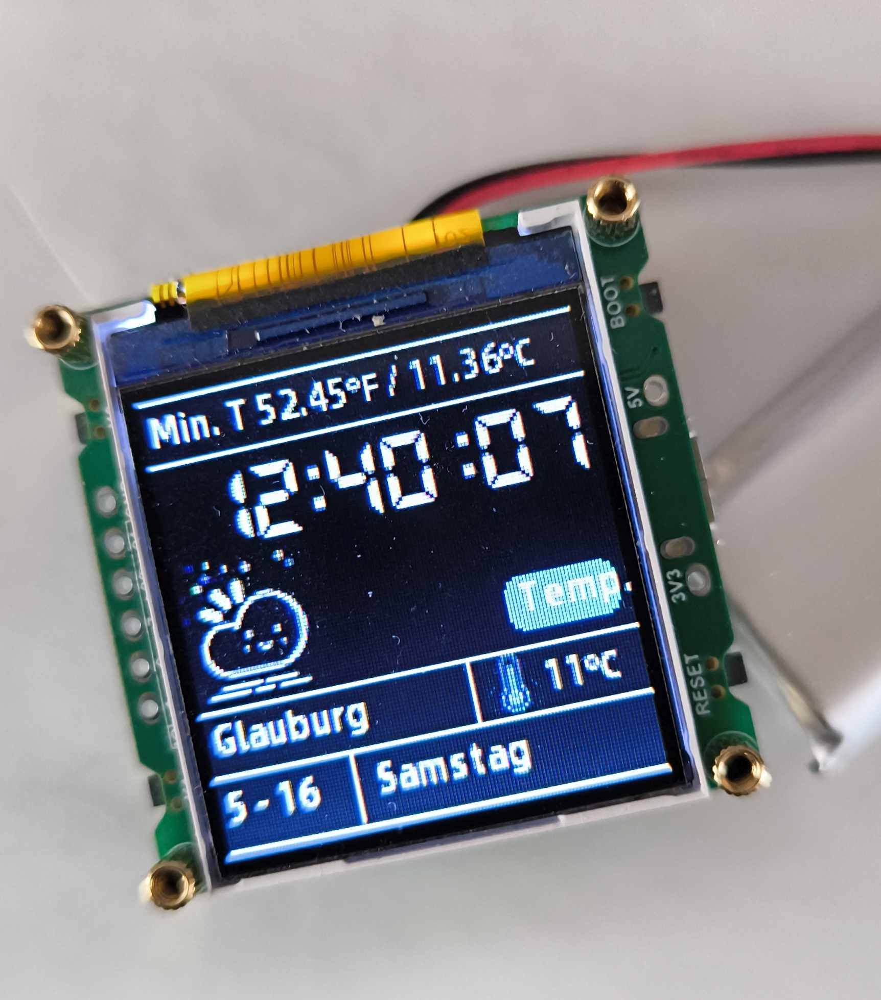

---
layout: artikel
title: "ESP32-C3 Trinket"
date: 2026-05-16
updated:
type: "Projekt"
topics:
  - Markdown
  - GitHub Pages
summary: "Kurze Zusammenfassung des Artikels."
hero:
status: "fertig"
difficulty:
permalink: /artikel/esp32-c3-trinket.html
---

# Tolle Idee!

Ich habe bei Ali Express dieses Teil gefunden:

Ich: !Klasse Preis, Akku bekommen wir auch noch rein. Wäre doch ein tolles Teil um ganz einfach eine digitale Peek Device daraus zu bauen. Für den Preis kann man nichts falsch machen .!

Ich auch nachdem es geliefert wurde: "So ein Schwachsinn! Angeblich Portabel und angeblich funktioniert das Testprogramm"

Denkste Puppe!

Also mal von Vorne:

Es handelt sich um einen kleinen Bausatz. Genau genommen müssen nur die Abstandshalter zusammengeschraubt werden und ein Akku in das Teil gepackt werden und das sollte es gewesen sein.
Naja, von was träume ich Nachts?
Also erstmal ausgepackt, USB an das Board angeschlossen und es startet. Soweit so gut.
Nun die erste Hürde:
Der angebliche Access Point den das Teil aufspannen soll, funktioniert natürlich nicht.
Naja nicht schlimm, gibt ja das Beispielprogramm, überschreiben wir die Netzwerkparameter und kompilieren es neu.
Ergebnis: Hat ein Moment gedauert bis ich alles zusammen hatte. Arduino IDE gestartet. Alles kompiliert, übertragen und weißer Bildschirm. Log auf der Seriellen Schnittstelle: Das Ding stürzt schon im Start sofort ab.

Na gut, ich habe keine Lust auf stundenlange Fehlersuche. Also das Repository genommen, und ein Codex (AI) Projekt daraus gemacht. War eh intern alles Chinesisch dokumentiert. Also die AI mal darauf los gelassen. Und siehe da nach einigen Hacks und Iterationen kann zumindest das Grundprogramm angezeigt werden. Und der Code ist auf deutsch Dokumentiert und vor allem das Projekt ist für Platform.io umgebaut worden.

Toll Akku rein und los geht's...

Nein leider nicht so wie ich mir das gewünscht hätte.
Das Teil hat keinerlei Mechanismen um es ein- oder auszuschalten. Kennt man, also das Programm erweitert, dass man das Board in den Tiefschlaf versetzen kann.

Und dann... OMG... die Entwickler dieses Boards haben keinerlei Vorkehrung getroffen, die Displayhintergrundbeleuchtung abschaltbar zu machen. Was dazu führt, dass man den Prozessor zwar in den Tiefschlaf versetzen kann, aber das Ding weiterhin leuchtet wie ein Weihnachtsbaum und der Akku demzufolge bald zur Neige geht.

Also nichts für den geplanten Einsatzzweck als kleine Magic Device. Ganz wollte ich dann aber doch nicht aufgeben. Ich habe kleine Schalter im Lager. Also mit Sekundenkleber ein Schalter auf das Board geklebt und die Stromversorgung zwischen Board und Akku schaltbar gemacht. Nicht die feine englische Art, aber nun kann man das Teil von der Stromversorgung trennen.

Hat leider die Unschönheit, dass man es zum Laden eingeschaltet lassen muss, da ja der Schalter den Akku vom Board trennt. Aber was soll's. Das Teil ist fertig.

# GitHub

Hier liegt das überarbeitete Demoprogramm

https://github.com/hesspet/ESP32C3_TRINKET

es ist ein Fork des originalen, nicht funktionsfähigen Demoprogramm des Herstellers: https://github.com/Spotpear/ESP32C3_1.44inch

* die grafische Bibliothek wurde gepatched, damit  sie funktioniert
* die chinesischen Kommentare wurden in das Deutsche übersetzt
* das Projekt wurde für platform.io umgesetzt. Es lässt sich nun z.B. über Visual Studio Code verwenden

# Fotos aus dem Projekt

