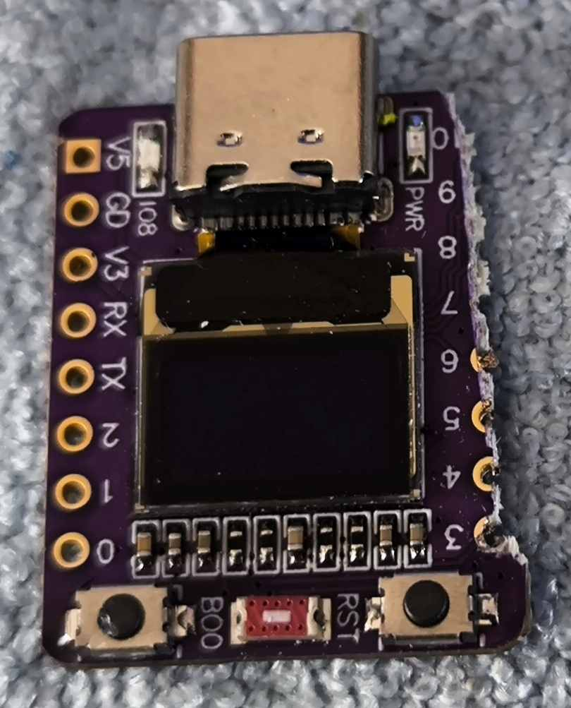
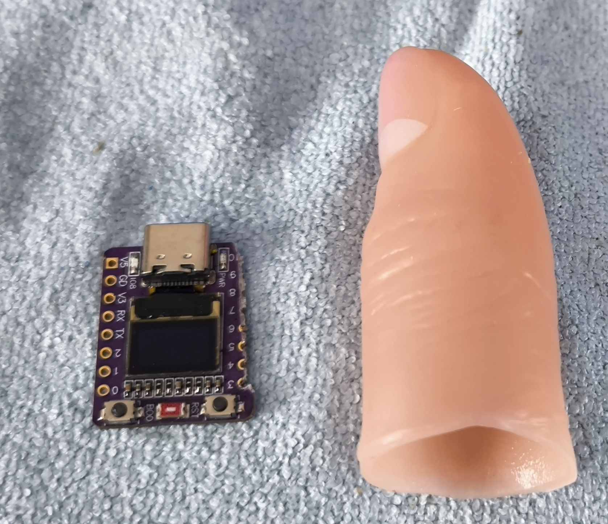
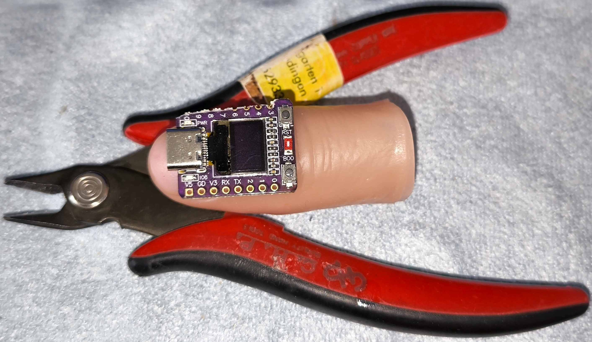
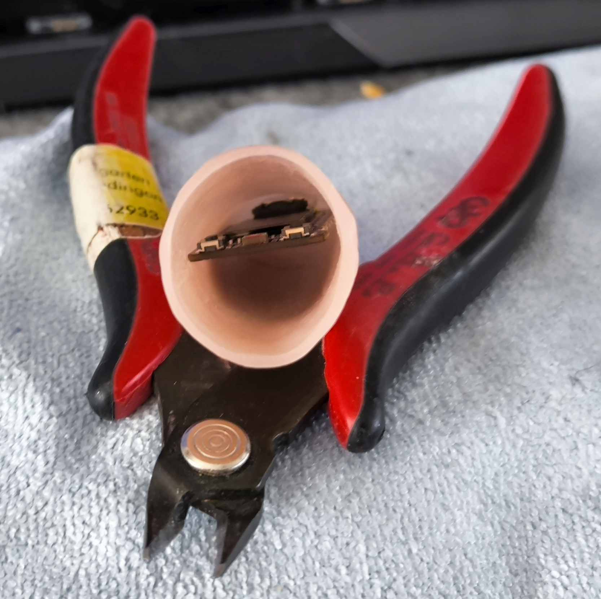
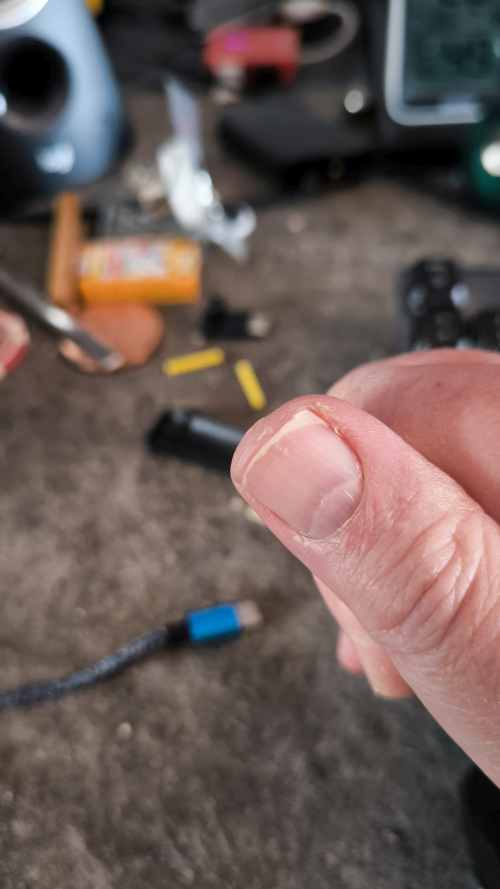
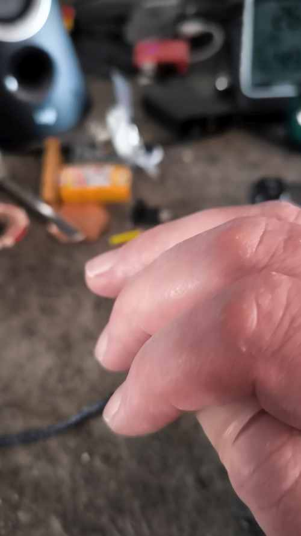
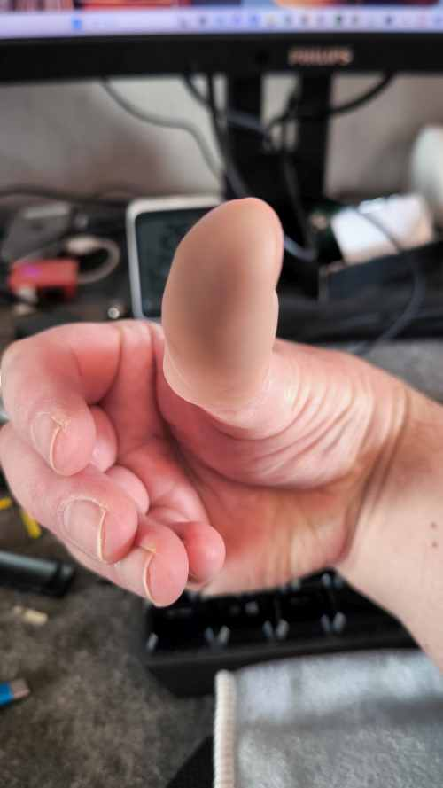
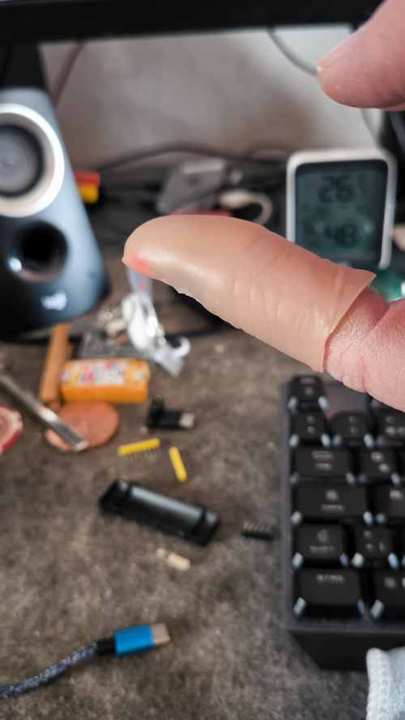
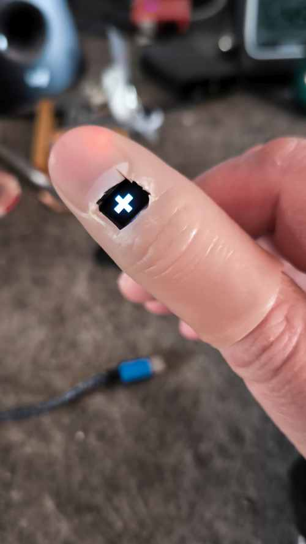
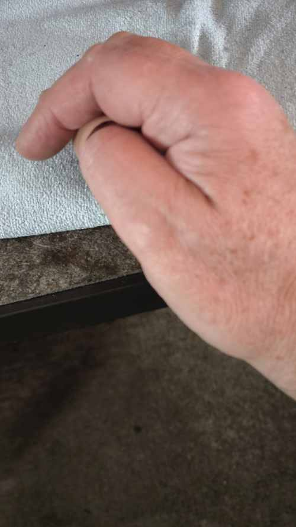

# 2026-04-24 Das Eckige muss ins Runde. Weitere Prompter Variante!

Wo kann man so einen kleinen Prompter denn noch einbauen?
Irgend wie hab ich mir in den Kopf gesetzt, dass diese kleine Platine ...

... in eine Daumenspitze passen müsste. Naja, sie ist ein ganz klein wenig zu breit. Also erstmal ganz dreckig die Lötaugen auf der einen Seite etwas abgeknabbert. Kann man besser machen, aber für ein Experiment. Laut Lupe sind da keine Empfindlichen Leiterbahnen drunter. 

Also erstmal abrassiert. Auf der anderen Seite ist das leider etwas problematischer. Die V5 und die GD (Ground) brauen wir. Nur, da finden sich noch ein paar Stellen an denen man da sich selbst anschließen kann. Kommt noch. Vorerst reicht sogar der kleine Eingriff.

Könnte irgendwie passen...geht. Also die Platine geht rein. Ich denke mit etwas Aufwand bekomme ich da auch so einen von den kleinen Akkus rein.

Zum Laden muss man die Platine immer rausmachen. Muss man bei eine D-Light auch. Was man auf jeden Fall vorsehen muss ist ein Faden oder ein Band, die Platine sitzt schon recht fest in der Daumenspitze fest.

Bisher ist es erst einmal eine Idee. Mal sehen was daraus wird.

## 2026-05-26 Der erste Prototype

Einfach mal ein Versuch, jetzt mit Akku alles drin und ab auf den Daumen.

   

Da hat einer ein Loch in meinen Daumen gemacht....

 

Sollte so gehen, Ok, den Ausschnitt könnte man hübscher machen, aber Hauptsache es funktioniert. Falls jetzt jemand glaubt, dass Bild wäre ein Fake. Nein, das Display ist wirklich so klar.

TBD: Ich sehe, ich muss nochmal ein Bild mit der invertierten Darstellung machen. Vielleicht fällt dann da das "Loch im Daumen" noch weniger auf.

